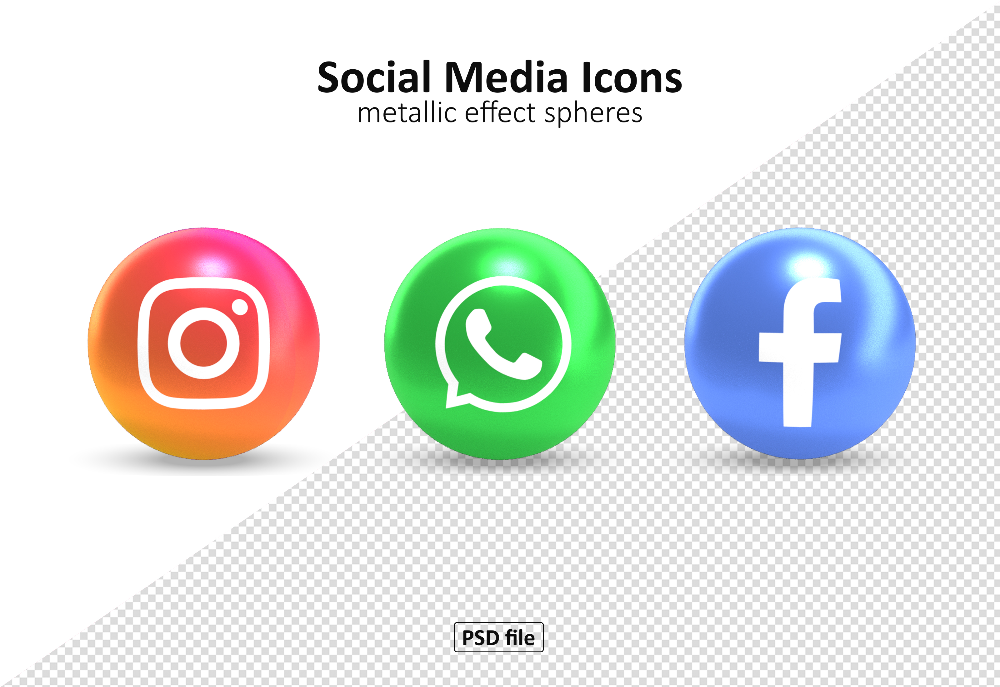

<!--HEADINGS-->
# My title(h1)
## My subtitle(h2)
### Paragraph title(h3)
###### Un título h6

<!--cursiva-->
this is an *italic* text
<!--negrita-->
this is a **strong** text

<!--strikethrough-->
y este es un ~~texto~~ tachado 
(strikethrough)

<!--Unorder List(ul)-->
* apple
    * green apple
* orange
* otras frutas

1. aple
    1. green apple
2. orange
3. otras frutas
4. etc

[React en español](https://es.reactjs.org/)


[React en español](https://es.reactjs.org/ "Texto mostrado")

> this is a quote

---
___

`console.log(res.send, 'respuesta');`

```javascript
import express from 'express';
const app = express();

import './database.js';
import  ('./routes/index.routes.js')

app.use(require('./routes/index.routes').default)

app.listen(3000);
console.log('Server on port: ' + 3000);

```

```python
print("Hello World")
```

| Juego             | Compañia    | Clasificacion | Precio (MXN) |
|-------------------|-------------|---------------|--------------|
| Animal Crossing   | Nintendo    | E             | 1600         |
| Persona 5         | Atlus       | T             | 1500         |
| Final Fantasy VII | Square Enix | T             | 1500         |
| Fortnite          | Epic Games  | M             | 0            |

[Data Tables library](https://rpubs.com/Juve_Campos/tablasRMarkdown "Juve Campos, tablas")

| Título | | | |hola |
|:-------------------:|---|---|---|---|
| Row1 | | | que tal| |
| Row2 | | todoBien| | |




<!-- GITHUB MARKDOWN -->


